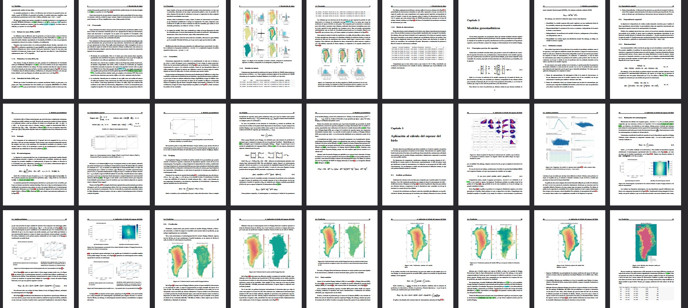

# Greenland ice thickness modelling

This is the code behind my bachelor thesis project, which was made in collaboration with the department of Geoscience, Aarhus University, and the Geological Survey of Denmark and Greenland research institute, using publicly available data:



The "PurgedClean" file consists of *extracts* of the working code that aims to increase readability when explaining it. Example snippet:

```
## ==== Prediction ====

#> Kriging model construction and prediction
nmin <- 1; nmax <- 100; maxdist <- 1e5
OK.model <- gstat(id = "OK", formula = as.formula("Thickness ~ 1"), 
                  data = TrainingData.df, locations = ~x+y, model = OK.thvar, 
                  nmin = nmin, nmax = nmax, maxdist = maxdist, set =list(gls=1))
OK.pred <- interpolate(covariables.rast, OK.model, cores = 4, cpkgs = "gstat", 
                       debug.level = 2, na.rm = TRUE, index = 3:4)
```

The datasets used are listed below and not uploaded, as they are of great size.

## Datasets

### Features

GIMP: https://nsidc.org/data/nsidc-0645/versions/1
Gravity: https://bgi.obs-mip.fr/catalogue/?uuid=df2dab2d-a826-4776-b49f-61e8b284c409
Surface mass balance: https://tc.copernicus.org/articles/12/811/2018/
Bedmachine: https://nsidc.org/data/idbmg4/versions/5
Ice velocity: https://nsidc.org/data/nsidc-0670/versions/1

### Ice thickness

CReSIS: https://data.cresis.ku.edu/data/rds/csv_good/
